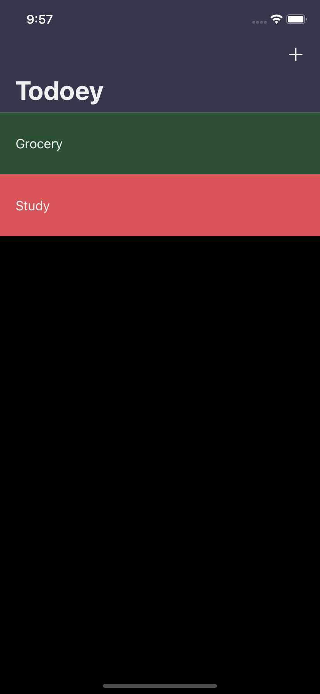

# Todoey

Todoey is a simple and intuitive to-do list app developed for iOS. It allows users to create, manage, and track their tasks efficiently. The app is designed with a clean and user-friendly interface, making it easy to stay organized and productive.

## Features
- **Add Tasks:** Easily add tasks with a single tap.
- **Mark Tasks as Completed:** Swipe to mark tasks as completed or delete them.
- **Task Categories:** Organize tasks under different categories to manage them more efficiently.
- **Persistent Storage:** Your tasks are saved locally and will remain even after closing the app.
- **User-friendly Interface:** Designed with simplicity and ease of use in mind.

## Installation

To install and run the Todoey app on your local machine, follow these steps:

### Clone the Repository:
```bash
git clone https://github.com/Kanha-Dev/Todoey-iOS13.git
```

### Open in Xcode:
Open the `Todoey.xcworkspace` file in Xcode.

### Install Dependencies:
Ensure that you have the latest version of Xcode and Swift installed.

### Run the App:
- Select your target device or simulator.
- Click the Run button or press `Cmd + R` to build and run the app.

## Usage

### Creating a New Task:
- Tap the `+` button to add a new task.
- Enter the task name and select a category.
- Save the task to add it to your list.

### Marking a Task as Completed:
- Swipe right on a task to mark it as completed.
- Swipe left to delete a task.

### Managing Categories:
- Tap the category name at the top to view tasks under different categories.
- You can switch between categories to manage specific tasks.

## Technologies Used
- **Swift:** The main programming language used for developing the app.
- **Xcode:** The integrated development environment (IDE) used for iOS development.
- **CoreData:** Used for persistent storage of tasks.
- **UIKit:** The framework used for the user interface.

## External Libraries and Frameworks
- **Realm:** A mobile database used for fast and efficient data storage.
- **ChameleonFramework:** A lightweight, yet powerful, color framework for iOS that makes it easy to add great colors to your app.
- **SwipeCellKit:** A powerful framework used for implementing swipeable table view cells, allowing users to swipe to delete or mark tasks as completed.

## Screenshots

### Todoey Home Screen (Blank)
The initial screen of Todoey where you can view your tasks. This screenshot shows a blank state with no tasks added yet.

### Categories (Populated)
This screen displays the different categories that the user has created, populated with tasks.

### Item Screen (Blank)
This is the item screen where you can view tasks within a specific category. This screenshot shows the screen before any tasks are added.

### Item Screen (Populated)
This screen displays the tasks that have been added within a specific category, showing a populated state.

### Delete Function (on Item)
Demonstrates the swipe-to-delete functionality, where a user can swipe left on a task to reveal the delete option.

<div style="display: flex; flex-wrap: wrap; gap: 10px; justify-content: space-between;">
    
    
    
    
    
</div>

## Contributing

If you'd like to contribute to Todoey, please fork the repository and use a feature branch. Pull requests are warmly welcome.

1. Fork the repository.
2. Create your feature branch (`git checkout -b feature/AmazingFeature`).
3. Commit your changes (`git commit -m 'Add some AmazingFeature'`).
4. Push to the branch (`git push origin feature/AmazingFeature`).
5. Open a pull request.

## License

This project is licensed under the MIT License - see the [LICENSE](LICENSE) file for details.

## Contact

For any inquiries or feedback, feel free to reach out to Your Name.
